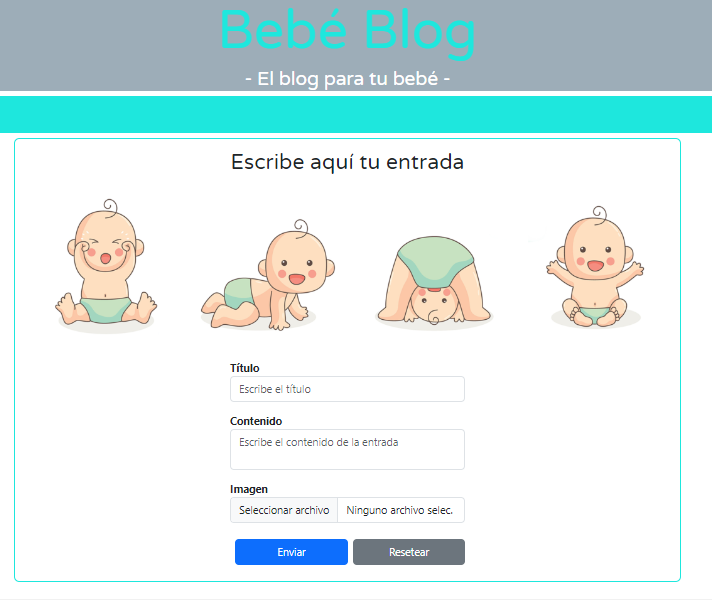

Nombre del proyecto : Bebé blog
Este proyecto se trata de un blog dedicado a temas relacionados con el mundo de los bebés. 
Aquí encontrarás información útil, consejos, recomendaciones y experiencias sobre el cuidado, la crianza, la alimentación, la salud y otros aspectos importantes relacionados con los bebés.

--------------------------------------------------------------------

----Tecnologías utilizadas----
NodeJS
React
CSS (utilizando la librería Bootstrap)
HTML
MySQL

----Descripción----
Realizaremos un blog sencillo con un sistema CRUD (Create, Read, Update, Delete). Esto significa que tendremos un sistema que nos permitirá crear entradas, mostrarlas en el feed de la página principal, editar esas entradas y eliminarlas, todo de manera dinámica.

Las entradas se guardarán en una base de datos MySQL, donde crearemos una tabla llamada "posts". Las imágenes se almacenarán en el servidor (en una carpeta pública) y guardaremos la ruta de cada imagen en la tabla de "posts" para poder mostrar las imágenes correctamente en la página.

El diseño es libre, excepto por los requisitos básicos de estructura HTML y que el feed esté centrado en la pantalla. Además, el diseño debe ser responsive.

----Partes de la aplicación----

El proyecto se dividirá en varias partes, entre las cuales se encuentran:

-Home: Incluye el feed del blog con un loop para mostrar las entradas existentes. Cada entrada contendrá una imagen, un título, una fecha de publicación y un extracto del contenido. Además, se incluirá un botón de borrado.

-Header: Con el nombre del blog.

-Nav: Permitirá agregar nuevas entradas.

-Entrada única completa: Mostrará una entrada en tamaño completo cuando se acceda a ella desde el feed. Incluirá una imagen, un título, una fecha de publicación y el contenido completo. También se agregarán botones de edición, guardado (en modo edición) y borrado.

-Página de añadir entrada: Proporcionará una plantilla básica con campos de entrada para capturar la información necesaria. Los campos incluyen adjuntar imagen, título de la entrada, contenido de la entrada y fecha automática. Se agregará un botón de guardar para guardar la entrada en la base de datos y almacenar la imagen en el servidor.

-----Sistemas------
-Editar entrada
Al hacer clic en el botón de editar, todos los campos de la entrada única cambiarán a modo de edición, lo que permitirá modificar los campos deseados.

-Borrar entrada
Con un simple botón se eliminará la entrada de la tabla "posts" enviando su ID al backend. No solo se eliminará de la base de datos, sino que también se deberá eliminar la imagen almacenada en el servidor para evitar ocupar espacio innecesario. 

------DEPENDENCIAS------
Este proyecto utiliza NodeJS, React y Bootstrap como tecnologías principales. A continuación, se proporciona una breve descripción de cada una:

-NodeJS: Utilizamos NodeJS para desarrollar el backend de nuestro blog y gestionar la interacción con la base de datos.

-React: Se utiliza para desarrollar el frontend de nuestra aplicación, creando componentes reutilizables que se actualizan de manera eficiente en función de los cambios en los datos.

Bootstrap: Para estilizar y darle formato a nuestros componentes y páginas.

-----VARIABLES DE ENTORNO -----
Este proyecto utiliza las siguientes variables de entorno para la configuración:

PORT: El puerto en el que se ejecutará el servidor. Por defecto, se establece en 3000.

DB_HOST: El host de la base de datos. Por defecto, se establece en localhost.

DB_USER: El nombre de usuario de la base de datos. Por defecto, se establece en root.

DB_NAME: El nombre de la base de datos a utilizar. Por defecto, se establece en blog_bd.

-----Requisitos técnicos---
Es importante destacar que para poder ejecutar este proyecto, es necesario tener instalado NodeJS y las dependencias especificadas en el archivo package.json. Esto se puede hacer ejecutando el comando npm install en ambas carpetas (backend y frontend) para instalar todas las dependencias especificadas en los archivos package.json. Después sigue los siguientes pasos:

Pasos a seguir:

Una vez instalados, abrir una terminal o línea de comandos.
-Navega a la carpeta del backend del proyecto.
-Ejecuta el comando npm start en la terminal para iniciar el servidor backend.
-Abre otra terminal o línea de comandos (manteniendo la primera terminal ejecutándose).
-Navega a la carpeta del frontend del proyecto.
-Ejecuta el comando npm start en la segunda terminal para iniciar el servidor de desarrollo del frontend.

Esto permitirá que tanto el servidor backend como el servidor de desarrollo del frontend se ejecuten simultáneamente. 

Después de ejecutar estos comandos, la aplicación se ejecutará automáticamente.